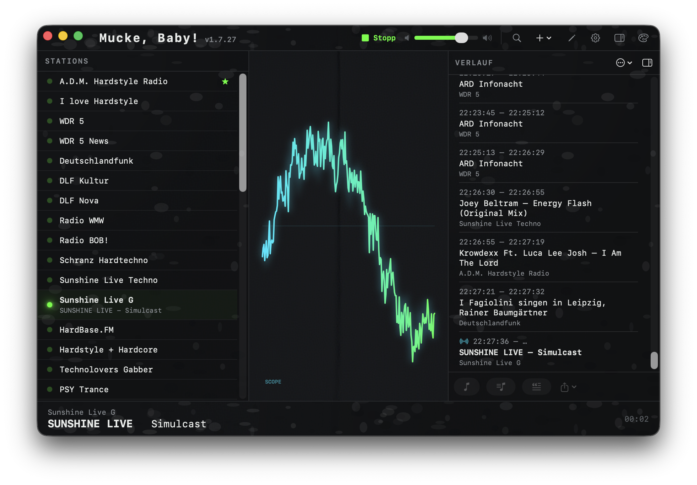
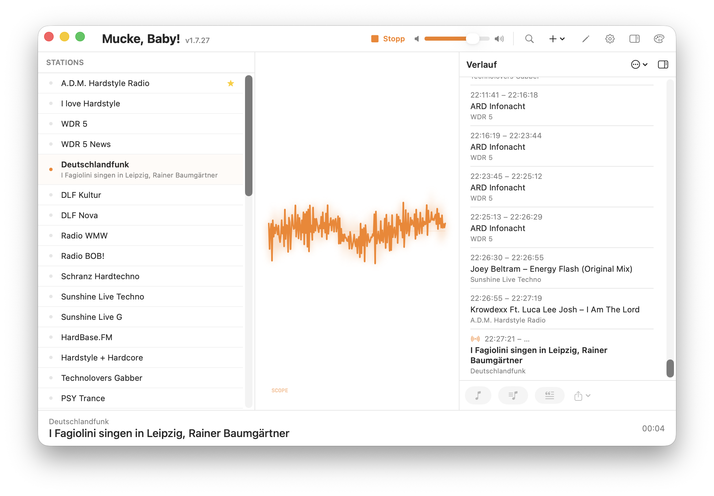
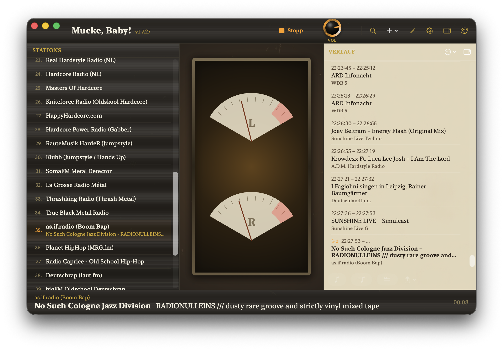
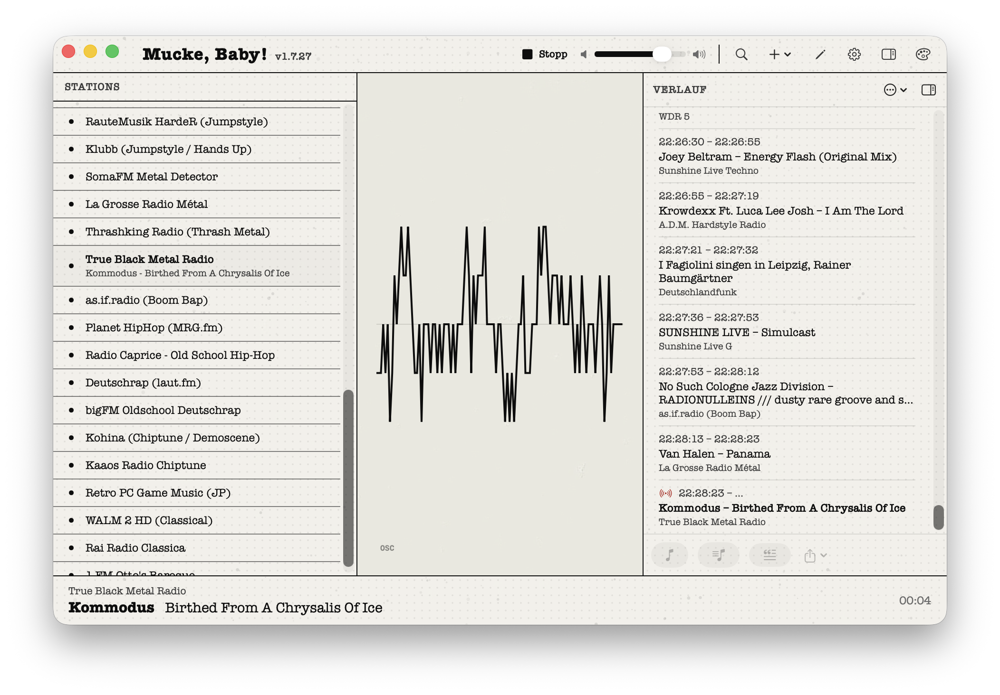
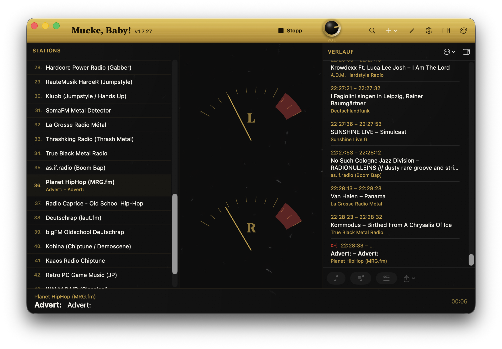
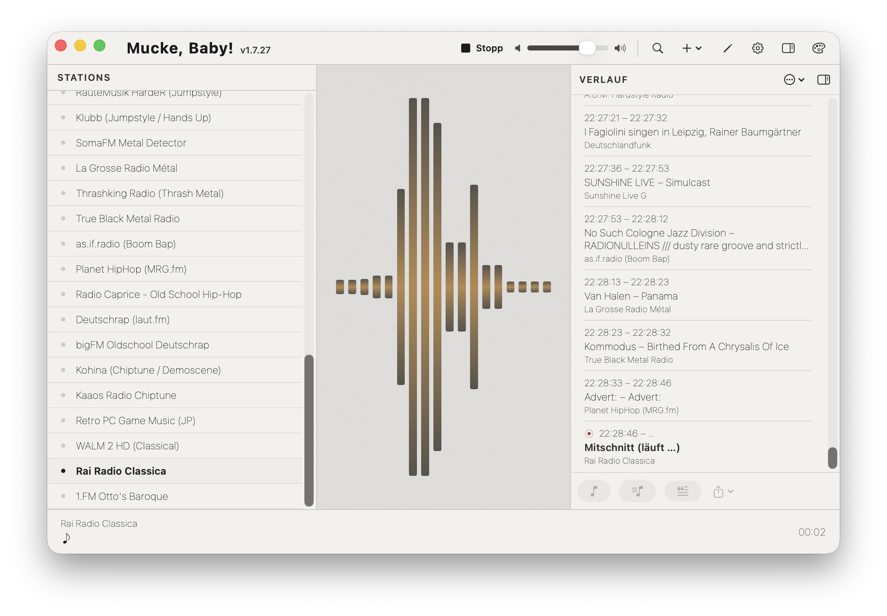
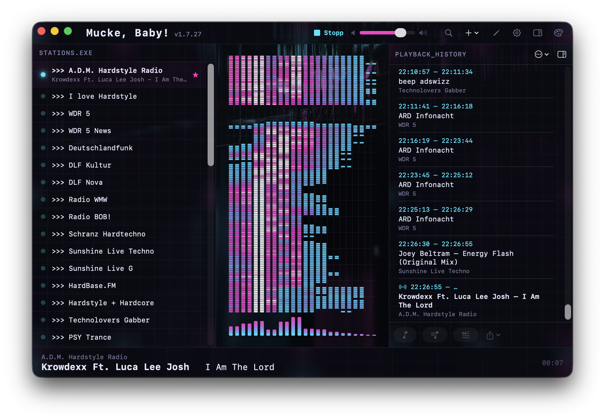

# Mucke, Baby!

**🌐 Sprache / Language:** [English](README.md) · [Deutsch](README.de.md)


Ein nativer macOS-Internetradio-Player (SwiftUI + VLCKit) mit sieben handgemachten Themes und audio-reaktiven Visualizern, die synchron zum tatsächlichen Klang laufen. Eine Mac-Umsetzung der Idee hinter dem Linux-Mint-Applet **Radio++**.

## Screenshots

<p align="center"></p>

| Standard | Retro | Fanzine |
|:--:|:--:|:--:|
|  |  |  |
| **GuitarAmp** | **Danish** | **Black MIDI** |
|  |  |  |

## Starten (Kommandozeile / headless-tauglich)

Kein Xcode-Projekt — die App wird mit `swiftc` zu einem `.app`-Bundle kompiliert. Es genügen die Command Line Tools. Die gesamte Toolchain ist skriptbar (praktisch für Automatisierung und KI-Agenten):

```bash
./build.sh                                       # baut "build/Mucke, Baby!.app" (lädt VLCKit einmalig, ~84 MB)
./run.sh                                         # bauen + starten
open "build/Mucke, Baby!.app"                    # starten
"build/Mucke, Baby!.app/Contents/MacOS/MuckeBaby" # starten mit Logs (Debug)
```

### Headless / Automatisierung

- **Theme-Screenshots ohne UI-Sitzung:** `MUCKE_SHOTS=<verzeichnis>` setzen — die App schaltet durch alle Themes, schreibt je ein PNG und beendet sich. `MUCKE_SHOT_W=<px>` überschreibt die Fensterbreite.
  ```bash
  MUCKE_SHOTS=/tmp/shots "build/Mucke, Baby!.app/Contents/MacOS/MuckeBaby"
  ```
- **Signiertes + notarisiertes DMG** (Developer ID, Hardened Runtime, DMG mit Hintergrundbild):
  ```bash
  bash wrappers/sign-and-release.sh                # → build/Mucke-Baby-<version>.dmg, Gatekeeper-sauber
  ```

## Funktionen

- Spielt **alle Codecs** über VLCKit/libVLC (mp3, aac, **ogg, opus**, flac, …).
- **Sieben Themes**, je mit eigenem Layout, eigenen Texturen und eigenem Visualizer: Standard, Acid Rave, Retro, Fanzine, GuitarAmp, Danish, Black MIDI.
- **Audio-reaktive Visualizer** — analoge VU-Nadeln, Oszilloskop, Spektrum-Balken und eine Piano-Roll — gespeist von einem **CoreAudio-Process-Tap** auf die eigene Tonausgabe. Dadurch ist das Bild perfekt synchron zum Ton und bleibt flüssig (~90 Hz).
- **Now-Playing** (Interpret/Titel) über einen eingebauten ICY-Metadaten-Leser (markier- und kopierbar), mit korrekter Dekodierung von Nicht-UTF-8-Sendern (UTF-8 → Shift-JIS/CP932 → Latin-1, z. B. japanische Sender).
- **Verlauf** — jeder Titel mit Start-/Endzeit und Sender, auch über Senderwechsel hinweg.
- Senderliste mit Play/Stop, Ein-/Ausblenden und Umsortieren pro Sender; ein **Favorit**, der beim Start automatisch spielt.
- Sender hinzufügen / bearbeiten / löschen; **kuratierte Genre-Listen** per Klick importieren.
- Playlist-Auflösung für `.pls` / `.m3u` / `.asx` / `.xspf` / radiotime `Tune.ashx`.
- Sendersuche über die offene API von [radio-browser.info](https://www.radio-browser.info).
- Hell- & Dunkelmodus; optionales Menüleisten-Symbol (standardmäßig aus).

### Berechtigung für die Audio-Reaktivität

Die Visualizer lesen die eigene Tonausgabe über einen CoreAudio-Process-Tap. Beim ersten Start fragt macOS **einmalig** nach der Erlaubnis zur Audioaufnahme; sie ist für die reaktiven Visuals nötig (mit Developer-ID-Signatur wird die Erlaubnis dauerhaft gemerkt). Ohne Erlaubnis spielt die App trotzdem — die Visualizer ruhen dann nur.

## Daten

Die Sender liegen in einer editierbaren JSON-Datei:

```
~/Library/Application Support/MuckeBaby/stations.json
```

Beim ersten Start wird sie aus `Resources/seed-stations.json` befüllt, falls vorhanden, sonst aus der generischen `Resources/seed-stations.example.json` (die einzige mitgelieferte Liste).

## ⚠️ Aufnahme ist standardmäßig AN

Dieser Build **schneidet den laufenden Stream dauerhaft auf die Platte mit** (roher Audio-Dump in `~/Music/MuckeBaby/Aufnahmen/`) — bewusst für den privaten Gebrauch des Autors. Zu beachten:

- Während ein Sender spielt, wird ständig geschrieben → **der Plattenverbrauch wächst**. Die Aufnahme **stoppt automatisch, wenn weniger als 10 GB frei** sind.
- Pro Sender wird eine neue Datei begonnen; lange Einzelsender-Sitzungen rollen nach 24 h beim nächsten Titelwechsel über.
- Die Aufnahme **öffnet eine zweite Verbindung** (Metadaten + Audio) für den Dump.
- **Das Aufnehmen von Radiostreams kann rechtlich eingeschränkt sein** — je nach Land und Verwendung; das liegt in der Verantwortung des Nutzers.

Abschalten unter **Einstellungen → Aufnahme** (oder `recordStreams = false`). Für eine öffentliche Veröffentlichung sollte der Standard auf AUS erwogen werden.

## Fremdbestandteile & Lizenzen

Vollständige Aufstellung in [`THIRD-PARTY.md`](THIRD-PARTY.md). Kurz:

- **VLCKit / libVLC** — **LGPL-2.1-or-later**, dynamisch gelinkt und im Bundle austauschbar. Quelle: <https://code.videolan.org/videolan/VLCKit>.
- **Theme-Texturen & App-Icon** — lokal mit einem Apache-2.0-Modell erzeugt (kommerzielle Nutzung erlaubt).
- **Schriften** — macOS-Systemschriften (nicht mitgeliefert). **Sender-URLs** sind Fakten; die Streams gehören den jeweiligen Sendern.

**Projekt-Lizenz:** [MIT](LICENSE) für den eigenen Quellcode dieses Projekts. Das eingebettete VLCKit/libVLC behält seine **LGPL-2.1-or-later**-Lizenz (dynamisch gelinkt und austauschbar; Pflichten erfüllt durch diesen Hinweis + den Quell-Link oben).

## Voraussetzungen

macOS **14.2+**, Apple Silicon, Xcode Command Line Tools (`xcode-select --install`).

---

*Status: privates Projekt. Funktionaler Nachbau der Idee hinter „Radio++" — es wurde kein Code und kein Asset von dort übernommen.*
