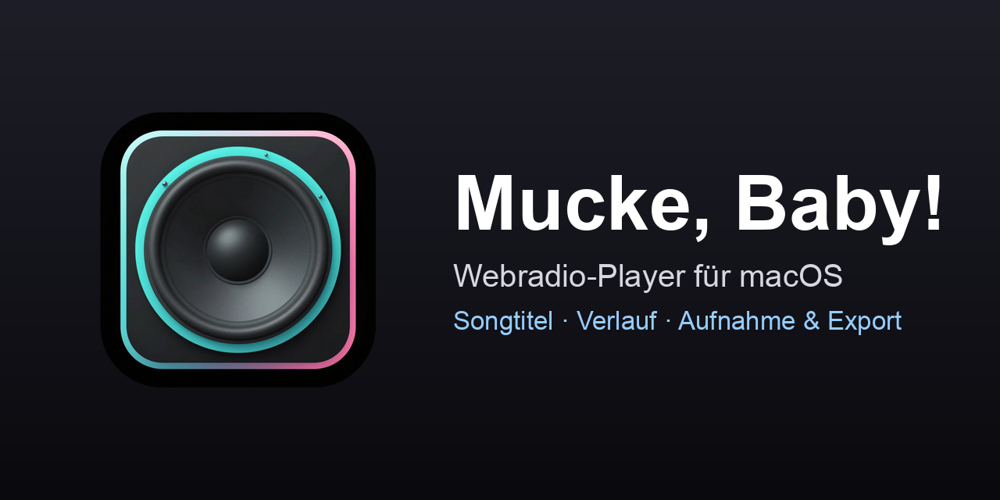

# Mucke, Baby!

**🌐 Sprache / Language:** [English](README.md) · [Deutsch](README.de.md)



A native macOS internet‑radio player (SwiftUI + VLCKit) with seven hand‑crafted visual themes and audio‑reactive visualizers that move in sync with the actual sound. A Mac take on the Linux Mint **Radio++** applet.

> The app's UI is in German; this README is English.

## Run it (CLI / headless‑friendly)

No Xcode project — the app is compiled with `swiftc` into a `.app` bundle. Only the Command Line Tools are required. The whole toolchain is scriptable (handy for automation and AI agents):

```bash
./build.sh                                       # build -> "build/Mucke, Baby!.app" (downloads VLCKit once, ~84 MB)
./run.sh                                         # build + launch
open "build/Mucke, Baby!.app"                    # launch
"build/Mucke, Baby!.app/Contents/MacOS/MuckeBaby" # launch with logs (debug)
```

### Headless / automation

- **Theme screenshots without a UI session:** set `MUCKE_SHOTS=<dir>` — the app cycles through all themes, writes one PNG per theme and quits. `MUCKE_SHOT_W=<px>` overrides the window width.
  ```bash
  MUCKE_SHOTS=/tmp/shots "build/Mucke, Baby!.app/Contents/MacOS/MuckeBaby"
  ```
- **Signed + notarized DMG** (Developer ID, hardened runtime, DMG with background image):
  ```bash
  bash wrappers/sign-and-release.sh                # -> build/Mucke-Baby-<version>.dmg, Gatekeeper‑clean
  ```

## Features

- Plays **all codecs** via VLCKit/libVLC (mp3, aac, **ogg, opus**, flac, …).
- **Seven themes**, each with its own layout, textures and visualizer: Standard, Acid Rave, Retro, Fanzine, GuitarAmp, Danish, Black MIDI.
- **Audio‑reactive visualizers** — analog VU needles, oscilloscope, spectrum bars and a piano‑roll — driven by a **CoreAudio process tap** on the app's own output, so the picture is perfectly in sync with the sound and stays smooth (~90 Hz).
- **Now‑playing** artist/title via a built‑in ICY metadata reader (selectable & copyable), with correct decoding of non‑UTF‑8 stations (UTF‑8 → Shift‑JIS/CP932 → Latin‑1, e.g. Japanese senders).
- **History panel** ("Verlauf") — every track with start/end times and station, kept across station switches.
- Station list with play/stop, per‑station show/hide and reordering; one **favorite** that auto‑plays on launch.
- Add / edit / delete stations; **curated genre lists** to import in one click.
- Playlist resolution for `.pls` / `.m3u` / `.asx` / `.xspf` / radiotime `Tune.ashx`.
- Station search via the open [radio‑browser.info](https://www.radio-browser.info) API.
- Light & dark mode; optional menu‑bar icon (off by default).

### Audio‑reactivity permission

The visualizers read the app's own audio output through a CoreAudio process tap. On first launch macOS asks once for audio‑recording permission; granting it is required for the reactive visuals (with a Developer‑ID signature the grant is remembered permanently). Without it the app still plays — the visualizers just idle.

## Data

Stations live in an editable JSON file:

```
~/Library/Application Support/MuckeBaby/stations.json
```

On first launch it is seeded from `Resources/seed-stations.json` if present, otherwise from the generic `Resources/seed-stations.example.json` (the only list that ships).

## ⚠️ Recording is ON by default

This build **continuously records the playing stream to disk** by default (raw audio dump in `~/Music/MuckeBaby/Aufnahmen/`), intentional for the author's personal use. Be aware:

- It writes constantly while a station plays → **disk usage grows**. Recording **auto‑stops when less than 10 GB is free**.
- A new file is started per station; long single‑station sessions roll over at the next song change after 24 h.
- Recording **opens a second connection** (metadata + audio) for the dump.
- **Recording radio streams may be legally restricted** depending on jurisdiction and use — your responsibility.

Turn it off in **Settings → Aufnahme** (or set `recordStreams = false`). For a public release, consider defaulting this to OFF.

## Third‑party & licensing

See [`THIRD-PARTY.md`](THIRD-PARTY.md) for the full breakdown. In short:

- **VLCKit / libVLC** — **LGPLv2.1‑or‑later**, dynamically linked and replaceable inside the bundle. Source: <https://code.videolan.org/videolan/VLCKit>.
- **Theme textures & app icon** — generated locally with an Apache‑2.0 model (commercial use allowed).
- **Fonts** — macOS system fonts (not bundled). **Station URLs** are facts; the streams belong to their broadcasters.

**Project license:** [MIT](LICENSE) for this project's own source code. The bundled VLCKit/libVLC keeps its **LGPL‑2.1‑or‑later** license (dynamically linked and replaceable; obligations met by this notice + the source link above).

## Requirements

macOS **14.2+**, Apple Silicon, Xcode Command Line Tools (`xcode-select --install`).

---

*Status: private / personal project. Functional reimplementation of the idea behind "Radio++" — no code or assets were taken from it.*
